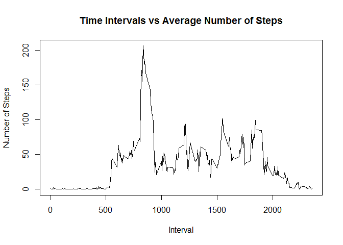
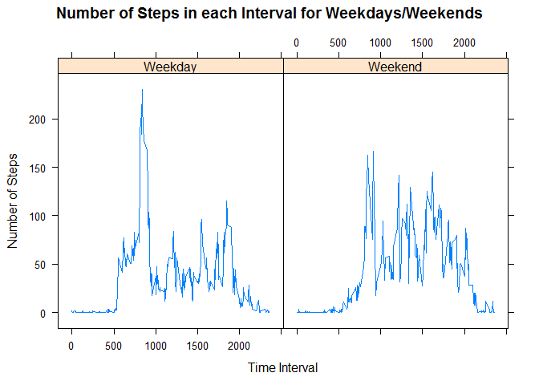

# Coursera Peer Assessment 1
Chris  
Tuesday, April 14, 2015  


## Loading and preprocessing the data

This section will detail the loading and processing of the Activity Monitoring Data Set. The dataset is first loaded in using the code below : 


```r
dataSet <- read.csv("activity.csv", sep=",")
```

The data is then converted into the correct format : 


```r
dataSet[, 1] <- as.numeric(as.character(dataSet[, 1]))
dataSet[, 3] <- as.numeric(as.character(dataSet[, 3]))
```

and a copy of the data set with the null steps removed is then created : 


```r
completeSet <- dataSet[!is.na(dataSet[, 1]),]
```

## What is mean total number of steps taken per day?

The section will go through the calculation and display of the mean total number of steps. Firstly, the total number of steps is calculated per day : 


```r
aggregate(completeSet$steps, by=list(completeSet$date), FUN=sum)
```

```
##       Group.1     x
## 1  2012-10-02   126
## 2  2012-10-03 11352
## 3  2012-10-04 12116
## 4  2012-10-05 13294
## 5  2012-10-06 15420
## 6  2012-10-07 11015
## 7  2012-10-09 12811
## 8  2012-10-10  9900
## 9  2012-10-11 10304
## 10 2012-10-12 17382
## 11 2012-10-13 12426
## 12 2012-10-14 15098
## 13 2012-10-15 10139
## 14 2012-10-16 15084
## 15 2012-10-17 13452
## 16 2012-10-18 10056
## 17 2012-10-19 11829
## 18 2012-10-20 10395
## 19 2012-10-21  8821
## 20 2012-10-22 13460
## 21 2012-10-23  8918
## 22 2012-10-24  8355
## 23 2012-10-25  2492
## 24 2012-10-26  6778
## 25 2012-10-27 10119
## 26 2012-10-28 11458
## 27 2012-10-29  5018
## 28 2012-10-30  9819
## 29 2012-10-31 15414
## 30 2012-11-02 10600
## 31 2012-11-03 10571
## 32 2012-11-05 10439
## 33 2012-11-06  8334
## 34 2012-11-07 12883
## 35 2012-11-08  3219
## 36 2012-11-11 12608
## 37 2012-11-12 10765
## 38 2012-11-13  7336
## 39 2012-11-15    41
## 40 2012-11-16  5441
## 41 2012-11-17 14339
## 42 2012-11-18 15110
## 43 2012-11-19  8841
## 44 2012-11-20  4472
## 45 2012-11-21 12787
## 46 2012-11-22 20427
## 47 2012-11-23 21194
## 48 2012-11-24 14478
## 49 2012-11-25 11834
## 50 2012-11-26 11162
## 51 2012-11-27 13646
## 52 2012-11-28 10183
## 53 2012-11-29  7047
```

And a Histogram below can be seen showing this 


```r
aggregateSteps <- aggregate(completeSet$steps, by=list(completeSet$date), FUN=sum)
hist(aggregateSteps[, 2], main="Total Number of Steps Per Day", xlab="Steps Per Day", ylab="Number of Days")
```

 

Finally, the Mean total number of steps taken per day is : 


```r
mean(aggregateSteps[, 2])
```

```
## [1] 10766.19
```

And the Median total number of steps taken per day is : 


```r
median(aggregateSteps[, 2])
```

```
## [1] 10765
```

## What is the average daily activity pattern?

This section will look at the daily activity pattern. 

The graph below looks at the time interval, vs the number of steps taken averaged accross all days. 


```r
aggregateInterval <- aggregate(completeSet$steps, by=list(completeSet$interval), FUN=mean)
plot(aggregateInterval[, 1], aggregateInterval[, 2], type="l", main="Time Intervals vs Average Number of Steps", xlab="Interval", ylab="Number of Steps")
```

 

And the interval with the maximum average number of steps is : 


```r
aggregateInterval[order(-aggregateInterval$x),][1, 1]
```

```
## [1] 835
```

## Imputing missing values

This section will look at dealing with missing values in the data.

Firstly, the number of records with missing values is shown below : 


```r
nrow(dataSet[!complete.cases(dataSet), ])
```

```
## [1] 2304
```

To deal with the missing data shown above, we need to come up with a stratergy to fill in the missing values. 

The strategy that will be used in this project will be to use the average value for the related interval.

Firstly, complete and incomplete records are split out : 


```r
completeCases <- dataSet[complete.cases(dataSet),]
incompleteCases <- dataSet[!complete.cases(dataSet),]
```

Incomplete cases are then merged with the aggregated interval data created earlier : 


```r
mergedData <- merge(incompleteCases, aggregateInterval, by.x = "interval", by.y = "Group.1")
```

Each NULL step value is then set to the average steps value for that interval : 


```r
mergedData$steps <- mergedData$x
```

and the data is then merged back into the original completed data, and ordered


```r
mergedData <- mergedData[,c(2, 3, 1)]
updatedData <- rbind(completeCases, mergedData)
updatedData <- updatedData[order(updatedData$date),]
```

Now that the null values have been populated with data, the histogram generated in the first section (total number of steps per day) will be repeated and compared. Firstly, the total number of steps for each day is calculated : 


```r
aggregate(updatedData$steps, by=list(updatedData$date), FUN=sum)
```

```
##       Group.1        x
## 1  2012-10-01 10766.19
## 2  2012-10-02   126.00
## 3  2012-10-03 11352.00
## 4  2012-10-04 12116.00
## 5  2012-10-05 13294.00
## 6  2012-10-06 15420.00
## 7  2012-10-07 11015.00
## 8  2012-10-08 10766.19
## 9  2012-10-09 12811.00
## 10 2012-10-10  9900.00
## 11 2012-10-11 10304.00
## 12 2012-10-12 17382.00
## 13 2012-10-13 12426.00
## 14 2012-10-14 15098.00
## 15 2012-10-15 10139.00
## 16 2012-10-16 15084.00
## 17 2012-10-17 13452.00
## 18 2012-10-18 10056.00
## 19 2012-10-19 11829.00
## 20 2012-10-20 10395.00
## 21 2012-10-21  8821.00
## 22 2012-10-22 13460.00
## 23 2012-10-23  8918.00
## 24 2012-10-24  8355.00
## 25 2012-10-25  2492.00
## 26 2012-10-26  6778.00
## 27 2012-10-27 10119.00
## 28 2012-10-28 11458.00
## 29 2012-10-29  5018.00
## 30 2012-10-30  9819.00
## 31 2012-10-31 15414.00
## 32 2012-11-01 10766.19
## 33 2012-11-02 10600.00
## 34 2012-11-03 10571.00
## 35 2012-11-04 10766.19
## 36 2012-11-05 10439.00
## 37 2012-11-06  8334.00
## 38 2012-11-07 12883.00
## 39 2012-11-08  3219.00
## 40 2012-11-09 10766.19
## 41 2012-11-10 10766.19
## 42 2012-11-11 12608.00
## 43 2012-11-12 10765.00
## 44 2012-11-13  7336.00
## 45 2012-11-14 10766.19
## 46 2012-11-15    41.00
## 47 2012-11-16  5441.00
## 48 2012-11-17 14339.00
## 49 2012-11-18 15110.00
## 50 2012-11-19  8841.00
## 51 2012-11-20  4472.00
## 52 2012-11-21 12787.00
## 53 2012-11-22 20427.00
## 54 2012-11-23 21194.00
## 55 2012-11-24 14478.00
## 56 2012-11-25 11834.00
## 57 2012-11-26 11162.00
## 58 2012-11-27 13646.00
## 59 2012-11-28 10183.00
## 60 2012-11-29  7047.00
## 61 2012-11-30 10766.19
```

and the histogram is then generated : 


```r
aggregateStepsU <- aggregate(updatedData$steps, by=list(updatedData$date), FUN=sum)
hist(aggregateStepsU[, 2], main="Total Number of Steps Per Day", xlab="Steps Per Day", ylab="Number of Days")
```

 

The mean for the new data is :

```r
mean(aggregateStepsU[, 2])
```

```
## [1] 10766.19
```

and the median is : 


```r
median(aggregateStepsU[, 2])
```

```
## [1] 10766.19
```

If you then compare this to the original data set (See the "Mean Total Number of Steps" section)l, it can be seen that

1. The mean has remained the same
2. The median has slightly increased, although is very similar to the original data set. 

The impact to the total number of steps per day by adding the missing values seems to have had little effect to the overall data set. The maximum frequency shown in the histogram has slightly increased, however the general spread of the data has remained the same. 

## Are there differences in activity patterns between weekdays and weekends?

This section will look into the differences in activity patterns between weekdays and weekends. 

Firstly, we need to determine whether each day is a weekday or a weekend. 


```r
days <- weekdays(as.Date(updatedData$date))
updatedData <- cbind(updatedData, days)


dayName <- c("Monday", "Tuesday", "Wednesday", "Thursday", "Friday", "Saturday", "Sunday")
dayLookup <- c("Weekday", "Weekday", "Weekday", "Weekday", "Weekday", "Weekend", "Weekend")
weekLookup <- data.frame(dayName, dayLookup)

mergedData <- merge(updatedData, weekLookup, by.x="days", by.y="dayName")
```

Now that the data frame has a factor, with the levels "Weekday" and "Weekend" (dayLookup) we can now aggregate the data and plot the graph. 

A Panel Plot is shown below, detailing the average number of steps for each interval spread over all days, grouped by Weekdays and Weekends.


```r
aggregatedData <- aggregate(mergedData$steps, by=list(mergedData$interval, mergedData[, 5]),FUN=mean)

library("lattice")
xyplot(aggregatedData$x ~ aggregatedData$Group.1 | aggregatedData$Group.2, type="l", xlab="Time Interval", ylab="Number of Steps", main="Number of Steps in each Interval for Weekdays/Weekends")
```

 
